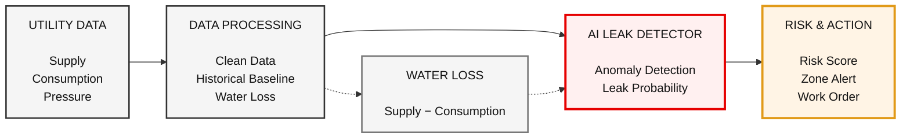
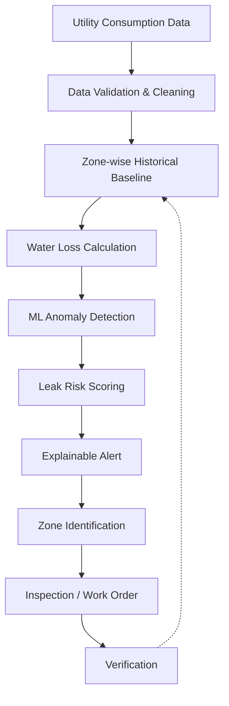

# AquaSentinel 💧

### AI-Powered Urban Water Pipeline Leakage Detection & Early Warning Platform

> **OMNIKON National Hackathon 2026**
> **Team:** TEAM TITANS
> **Theme:** Smart Cities and Governance
> **Problem:** Faster Detection of Urban Water Pipeline Leakage

---

## 🚨 Problem

Urban water distribution networks can experience pipeline leakage that remains undetected for long periods. Since a significant amount of water may be lost before a visible failure is reported, utilities need a faster and more data-driven way to identify abnormal water usage.

The challenge is to analyze available utility consumption data and identify suspicious patterns that may indicate hidden pipeline leakage.

---

## 💡 Proposed Solution

**AquaSentinel** is an AI-powered software platform that analyzes water supply, consumption, pressure, and historical usage patterns across urban distribution zones.

The platform establishes a normal consumption baseline for each zone and continuously compares new utility data against that baseline. When the system detects unusual behavior, it calculates unexplained water loss and applies machine-learning-based anomaly detection to determine whether the pattern may indicate a pipeline leak.

Instead of simply reporting abnormal consumption, AquaSentinel converts the detected anomaly into an actionable **Leak Risk Score**, identifies the affected zone, explains the reasons behind the alert, and prioritizes the incident for municipal inspection.

### Core flow

**Utility Data → Data Processing → AI Anomaly Detection → Leak Risk → Zone Alert → Field Action**

---

## 🎯 Key Features

* 📊 **Utility Data Analysis**
  Analyze water supply, consumption, pressure, time, and historical usage data.

* 📈 **Normal Consumption Baseline**
  Learn expected consumption patterns for individual urban zones.

* 🤖 **AI-Based Anomaly Detection**
  Detect unusual consumption behavior using machine learning.

* 💧 **Water Loss Estimation**
  Calculate unexplained water loss using the water-balance approach.

* 🚨 **Leak Risk Score**
  Convert multiple signals into an understandable 0–100 risk score.

* 🗺️ **Zone-Level Identification**
  Highlight the urban zone where suspicious activity is detected.

* 🔍 **Explainable Alerts**
  Show why an area was flagged instead of providing only a black-box prediction.

* 👷 **Inspection Prioritization**
  Generate a prioritized incident/work-order concept for municipal field teams.

---

## 🧠 How Leak Detection Works

AquaSentinel uses a combination of water-balance analysis and machine-learning-based anomaly detection.

### 1. Water Balance

The first indicator is unexplained water loss:

```text
Water Loss = Water Supplied − Measured Consumption
```

The percentage of unexplained loss can be estimated as:

```text
Loss % = (Water Supplied − Consumption) / Water Supplied × 100
```

### 2. Anomaly Detection

The system learns historical consumption behavior for each zone.

It considers factors such as:

* Time of day
* Day of week
* Historical consumption
* Current water supply
* Current consumption
* Pressure variation
* Persistence of abnormal behavior

A machine-learning anomaly detector identifies patterns that significantly differ from the expected behavior.

### 3. Leak Risk

The anomaly signal is combined with water-loss and operational indicators to produce a **Leak Risk Score from 0–100**.

```text
Consumption Anomaly
        +
Unexplained Water Loss
        +
Pressure Drop
        +
Persistence
        ↓
   Leak Risk Score
        ↓
 Zone Alert & Action
```

---

## 🏗️ System Architecture



---

## 🔄 Detection Workflow



---

## 🛠️ Technology Stack

### Frontend

* React
* Vite
* Recharts
* Leaflet
* OpenStreetMap

### Backend

* Python
* FastAPI

### Machine Learning

* Pandas
* NumPy
* scikit-learn
* Isolation Forest for anomaly detection

### Data Storage

* SQLite for the prototype
* CSV-based datasets for initial experimentation

### Future Data Integration

The architecture can later accept:

* Smart water-meter data
* Flow-meter data
* Pressure sensors
* Utility APIs
* SCADA/IoT data

---

## 🤖 Machine Learning Approach

The initial prototype uses **Isolation Forest**, an unsupervised anomaly-detection algorithm available in scikit-learn.

This approach is suitable for the prototype because real-world labelled leak datasets may be difficult to obtain. Instead of requiring every historical event to be labelled as a leak or non-leak, the model can identify unusual patterns in utility data.

Potential input features include:

```text
zone_id
timestamp
hour
day_of_week
water_supplied
water_consumed
pressure
historical_average
rolling_average
water_loss
loss_percentage
consumption_deviation
```

The output is an anomaly signal that contributes to the Leak Risk Score.

---

## 📊 Example Detection Scenario

Consider an urban distribution zone:

```text
Water Supplied:       10,000 L
Measured Consumption:  6,500 L
Unexplained Loss:      3,500 L
```

The system also observes:

```text
✓ Consumption significantly differs from the historical baseline
✓ Unexplained water loss is high
✓ Pressure has decreased
✓ Abnormal behavior persists over multiple readings
```

AquaSentinel can then generate an alert such as:

```text
🔴 HIGH LEAK RISK

Zone: Z-04

Estimated Unexplained Loss: 3,500 L

Reasons:
• Abnormal consumption pattern
• High unexplained water loss
• Pressure deviation
• Persistent anomaly

Recommended Action:
Prioritize pipeline inspection in Zone Z-04
```

---

## 🏙️ Municipal Dashboard Concept

The proposed platform provides a centralized dashboard for municipal authorities.

```text
┌──────────────────────────────────────────────┐
│              AQUASENTINEL                   │
│       Urban Water Intelligence              │
├────────────┬────────────┬────────────────────┤
│ Zones      │ Alerts     │ Water Loss         │
│ Monitored  │ Active     │ Estimated          │
├────────────┴────────────┴────────────────────┤
│                                              │
│               CITY ZONE MAP                  │
│                                              │
│      🟢 Z01       🟢 Z02                    │
│                    🟡 Z03                    │
│                              🔴 Z04          │
│                                              │
├──────────────────────────────────────────────┤
│ ALERT: Z04                                   │
│ Leak Risk: HIGH                              │
│ Estimated Loss: 3,500 L                      │
│ Recommended: Pipeline Inspection             │
└──────────────────────────────────────────────┘
```

---

## ⭐ Innovation

AquaSentinel is not limited to detecting abnormal consumption.

The proposed solution combines four important stages:

```text
1. WATER BALANCE
       ↓
2. AI ANOMALY DETECTION
       ↓
3. EXPLAINABLE LEAK RISK
       ↓
4. OPERATIONAL ACTION
```

This transforms raw utility data into an actionable municipal decision.

### Key differentiator

**Instead of asking only "Is something abnormal?", AquaSentinel asks:**

> **"Where is the abnormality, how serious could it be, why was it detected, and which area should be inspected first?"**

---

## 🌱 Impact

### Environmental Impact

* Reduces avoidable water wastage.
* Supports more efficient use of treated water.
* Helps reduce unnecessary pumping and treatment losses.

### Social Impact

* Supports more reliable urban water distribution.
* Helps reduce prolonged unnoticed leakage.
* Enables faster municipal response.

### Economic Impact

* Helps utilities prioritize maintenance resources.
* Reduces avoidable water loss.
* Provides data-driven maintenance prioritization.

### Smart City Impact

AquaSentinel contributes to a more data-driven urban water management system by turning utility data into early warnings and actionable insights.

---

## ⚙️ Feasibility

The first prototype can be developed without expensive physical infrastructure.

### Prototype

```text
Synthetic / Sample Utility Data
            ↓
      Python Processing
            ↓
     ML Anomaly Detection
            ↓
       FastAPI Backend
            ↓
     React Dashboard
```

The prototype can later be connected to real utility data sources.

### Advantages

* Software-first implementation
* Lightweight machine-learning model
* Can operate using existing utility data
* No specialized hardware required for the initial prototype
* Can scale from individual zones to larger urban networks

---

## ⚠️ Challenges & Mitigation

| Challenge                        | Proposed Mitigation                                                |
| -------------------------------- | ------------------------------------------------------------------ |
| Missing or noisy meter data      | Data validation and preprocessing                                  |
| Legitimate consumption spikes    | Historical and time-based baselines                                |
| Different patterns between zones | Zone-specific analysis                                             |
| False leak alerts                | Combine multiple indicators                                        |
| Limited labelled leak data       | Unsupervised anomaly detection                                     |
| Sensor/API availability          | Begin with simulated/sample data and design for future integration |

---

## 🚀 Future Scope

AquaSentinel can be extended with:

* Real-time IoT flow and pressure sensors
* Smart-meter integration
* GIS-based pipeline network visualization
* Advanced time-series forecasting
* Automatic maintenance scheduling
* Mobile application for field workers
* Leak repair verification
* Historical leak-risk mapping
* Integration with municipal water-management systems

---

## 👥 Team

**TEAM TITANS**

* **MACHABATHUNI VISHNU VARDHAN**
* **SHAIK BEE BEE RESHMA**

**Theme:** Smart Cities and Governance

**Hackathon:** OMNIKON National Hackathon 2026

---

## 📚 Research Basis

The solution concept is based on the water-balance/non-revenue-water approach to understanding unexplained water losses, combined with machine-learning anomaly detection and operational prioritization.

### References

1. World Bank — Non-Revenue Water and water-loss reduction
   https://blogs.worldbank.org/en/water/what-non-revenue-water-how-can-we-reduce-it-better-water-service

2. World Bank — Urban Water Supply and Sanitation in India
   https://www.worldbank.org/en/news/feature/2011/09/22/urban-water-supply-india

3. World Bank — Non-Revenue Water Analysis and Reduction Tool
   https://ppp.worldbank.org/library/non-revenue-water-analysis-and-reduction-water-balance-easy-calc-tool

4. scikit-learn — Isolation Forest
   https://scikit-learn.org/stable/modules/generated/sklearn.ensemble.IsolationForest.html

5. OpenStreetMap
   https://www.openstreetmap.org/

---

## 📌 Project Status

**Stage:** Hackathon Round 1 — Solution Proposal

The repository currently contains the project proposal and system design. The implementation architecture is designed to support development of the working prototype in subsequent stages.

---

## 💧 AquaSentinel

> **Detect the leak before the water is lost.**
